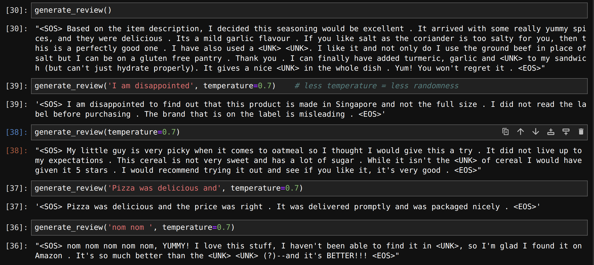

<div align="center"> <h1> Text generation: Food reviews </h1> </div>
<div align="center"><a>Jovana&nbsp;Gentić 🦆</a></div>
<div align="center"><a href="https://www.kaggle.com/code/jovanagenti/spectrogram-classification-with-conv1d-97-7">kaggle notebook</a></div>

<br>
<br>

"Text generation: Food reviews" is a next word prediction model. We used LSTMs, CNNs, and transformers to learn to generate new reviews based on beggining of sentence we give to the model. This repo is written in Tensorflow.

<div align="center"></div>

# Installation #
To download dataset, go to https://www.kaggle.com/datasets/snap/amazon-fine-food-reviews. Dataset folder should be called `dataset` and it should be placed in the same folder as `preprocess.py`.
This dataset consists of ~390,000 unique fine foods reviews from amazon. 
```
pip install -r requirements
```
# Running the code #
###
To prepare vocabulary for the model, execute command:

```
python preprocess.py
```

### Model training
To train the model, execute command:

```
python train.py
```
<div align="center"></div>
<div align="center"></div>

# Review generation #
To generate new reviews, change the temperature and the starting sentence input to the model in `generate.py`, and execute command:

```
python generate.py
```
<div align="center"></div>
